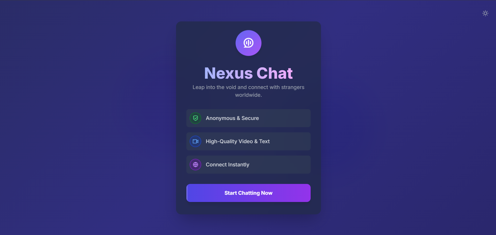
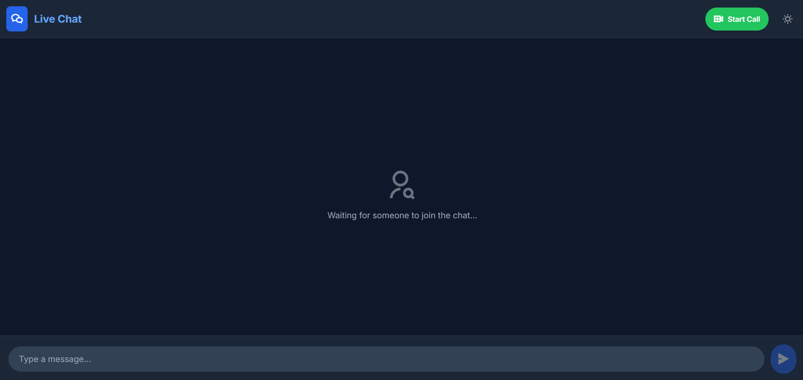

# Nexus Chat - A Modern Omegle Clone

Nexus Chat is a feature-rich, anonymous chat application inspired by Omegle. It allows users to connect with strangers instantly for one-on-one conversations using either text or high-quality video. The project is built with a sleek, modern, and animated user interface that supports both light and dark themes.

---
## 🚀 Live Demo

You can view the live project here: **[https://nexuschat-g9x2.onrender.com](https://nexuschat-g9x2.onrender.com)**

---

## ✨ Features

* **Instant Anonymous Chat**: Connect with a random stranger with a single click. No registration required.
* **Text & Video Chat**: Seamlessly switch between text-based messaging and real-time video conversations.
* **Stunning User Interface**: A modern, animated landing page and a clean, intuitive chat interface.
* **Real-time Communication**: Powered by **Socket.IO** for instant message delivery and signaling.
* **Peer-to-Peer Video**: Utilizes **WebRTC** for direct, high-quality, and low-latency video calls.
* **Typing Indicators**: See when the other user is typing a message.
* **Light & Dark Modes**: A beautiful, theme-able UI that respects user system preferences and can be toggled manually.
* **Fully Responsive**: Looks and works great on all devices, from desktops to mobile phones.

---

## 🚀 Tech Stack

This project is built entirely with front-end technologies and a Node.js backend for signaling.

* **Frontend**:
    * **HTML5**: For the core structure of the application.
    * **Tailwind CSS**: For all styling, enabling a modern and responsive design.
    * **JavaScript (ES6+)**: For all client-side logic, DOM manipulation, and interactivity.
    * **Remixicon**: For high-quality and consistent icons.
* **Backend & Real-time**:
    * **Node.js & Express**: Required for serving the files and as a signaling server.
    * **Socket.IO**: For real-time event-based communication between clients (chat, typing indicators, WebRTC signaling).
    * **WebRTC**: For establishing peer-to-peer connections for video and audio streams directly between users.

---

## 🖼️ Screenshots

**Landing Page**

**Chat Interface**

---

## 💡 How To Use

1.  Visit the landing page.
2.  Click the **"Start Chatting Now"** button.
3.  You will be automatically paired with another user in a private chat room.
4.  Use the input field to send text messages.
5.  Click the **"Start Call"** button to initiate a video call with the other user.
6.  Use the on-screen controls to mute your mic, turn off your camera, or hang up.
